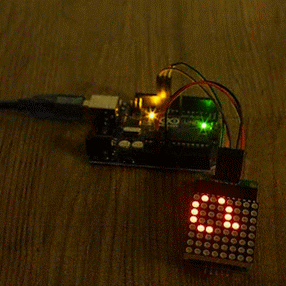

# Game of Life for Arduino with 8x8 LED matrix

## Introduction

When powered, the arduino will play a game of Game of Life by itself and
display the results on the attached LED matrix.

Small project to teach myself Arduino and programmable LEDs.

Some code copied from my earlier Java applet version of the game.

Game of Life rules:
1. Any live cell with fewer than two neighbours dies, as if by loneliness.
2. Any live cell with more than three neighbours dies, as if by overcrowding.
3. Any live cell with two or three neighbours lives, unchanged, to the next
   generation.
4. Any dead cell with exactly three neighbours comes to life.



## Hardware

* Arduino Uno R3
* Unidentified LED matrix board consisting of:
  * MAX7219 Serially Interfaced, 8-Digit LED Display Driver
  * 1088AS 8x8 3mm LED matrix
* 5 male-to-female 1 wire patch cables
* USB cable for sketch upload and power

## Hardware Setup

Using the patch cables, connect the Arduino to the matrix board as follows:

* Arduino 5V to "VCC"
* Arduino GND to "GND"
* Arduino Digital Pin 10 to "CLK"
* Arduino Digital Pin 11 to "CS"
* Arduino Digital Pin 12 to "DIN"

Note: The unidentified matrix board I have uses slightly different labels to
what may be found in the MAX7219 datasheet.

## Arduino IDE Setup

Add the "LedControl" library to the Arduino IDE:
* Oepn the "Sketch" menu
* Select the "Include Libraries" submenu
* Select "Manage Libraries"
* From the "Library Manager" type "ledcontrol" into the filter
* Click on the "LedControl" library item
* Click the "Install" button that appears

Ensure the Arduino IDE is configured for the Arduino board model:
* Open the "Tools" menu
* Select the "Board" submenu
* Select your Arduino board (in my case Arduino Uno)

Select the port for uploading the sketch to the board:
* Open the Tools menu
* Select the Port submenu
* Select the appropriate port on your computer (e.g. /dev/cu.usbmodemXXX)

Note: If the port is not displayed, connect the USB cable to your computer and
Arduino board and check again.

## Sketch installation to Arduino

Follow the Arduino IDE Setup steps first.

To install the sketch to the Arduino board:
* Open the Arduino IDE
* Open the Sketch file GameOfLife.ino
* Click the upload button

## Usage

The game is zero-player and requires no interaction.

When powered on the game will play by itself. It will usually play a random
game board where grid cells are randomly turned on at the start. There is a
small chance each time the board resets that it will play a pre-defined custom
game pattern.

It has conditions to reset itself if the board has not change for a short while
or the game has run for a certain duration. That should avoid it being stuck in
a single state for too long.

You can click the reset button on the Arduino board to trigger a game reset
too.

## Development

This repository uses pre-commit to ensure code consistency when making changes.

If you plan on making changes to this repository, please follow these steps.

Install pre-commit with python:
```shell
python -m pip install pre-commit
```

Install pre-commit hooks that require binaries with homebrew:
```shell
brew install clang-format
```

Install the pre-commit hook:
```shell
cd /path/to/repository
pre-commit install
```
